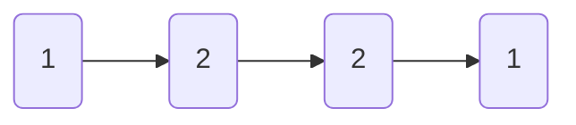
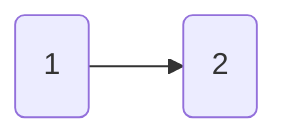

# 234. Palindrome Linked List (Easy)

LeetCode: https://www.leetcode.com/problems/palindrome-linked-list

Given the head of a singly linked list, return true if it is a palindrome or false otherwise.

Example 1:



```
Input: head = [1,2,2,1]
Output: true
```

Example 2:



```
Input: head = [1,2]
Output: false
```

# Solutions

The problem itself is not difficult to solve. We can solve the problem in two different ways; the first is pretty basic. We need to convert the LinkedList into a slice/array and compare the start with the end of the array. 

But the second one is more elaborated since we don't need the extra memory to copy the entry into an array; we just need to know where the middle of the list is, reverse the middle, and compare it with the beginning.  

## 1. Convert to Slice

Basically, we just need to implement a method to convert from `*ListNode` to `[]int`. after that, we can compare the and of the slice with the beginning and check if they are equal or not.

```golang
// converts into slice
func getSlice(head *ListNode) []int {
	result := []int{}
	for head != nil {
		result = append(result, head.Val)
		head = head.Next
	}
	return result
}
```

```golang
// final solution
func isPalindrome(head *ListNode) bool {
	slice := getSlice(head)
	size := len(slice)

	for idx := 0; idx < size/2; idx++ {
		if slice[idx] != slice[size-1-idx] {
			return false
		}
	}
	return true
}
```

## 2. Finding the middle pointer

This solution is better than the previous one since we don't need to use any extra memory to allocate all the list into an slice.

This solution is more complex than the previous one but saves memory, avoiding copying the entry list into a slice. The main idea is to find where the middle of the list `splits` it into two pieces and reverse the second half; that way, both lists need to be exactly the same.

To do that, basically, we need to do the following steps:
1. Find the middle pointer
```golang
// returns the pointer of the middle node in the list
func getMiddlePointer(head *ListNode) *ListNode {
	fastPointer, slowPointer := head, head
	for fastPointer != nil && fastPointer.Next != nil {
		slowPointer = slowPointer.Next
		fastPointer = fastPointer.Next.Next
	}
	return slowPointer
}
```

2. Reverse the 2half of the list
```golang
func reverseList(head *ListNode) *ListNode {
	reverse := head
	element := head.Next
	reverse.Next = nil

	for element != nil {
		tmp := element.Next
		element.Next = reverse
		reverse = element
		element = tmp
	}

	return reverse
}
```

3. Compare both lists.
```golang
// final solution
func isPalindrome(head *ListNode) bool {
	middlePointer := getMiddlePointer(head)
	reverseList := reverseList(middlePointer)

	for reverseList != nil {
		if head.Val != reverseList.Val {
			return false
		}
		head = head.Next
		reverseList = reverseList.Next
	}
	return true
}
```

